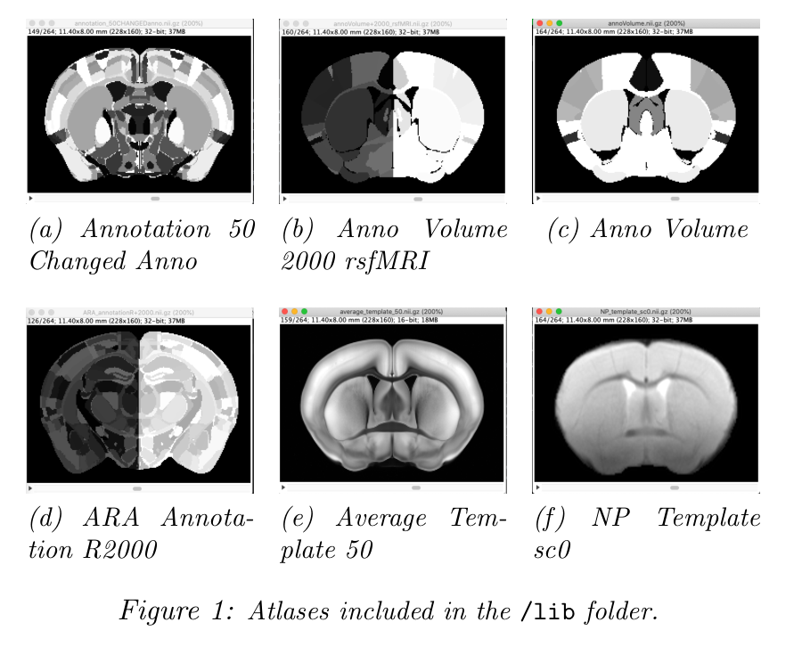
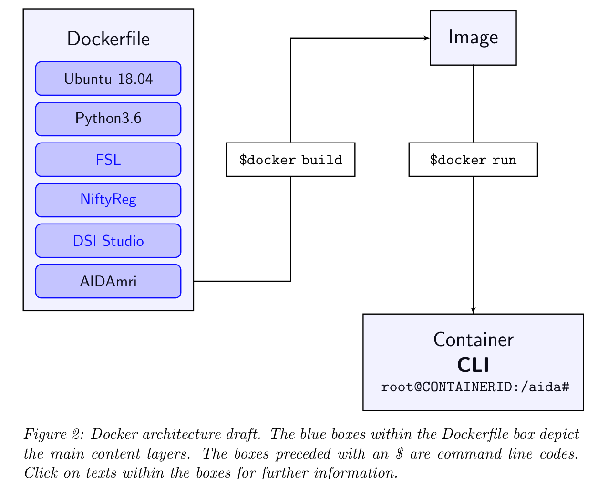
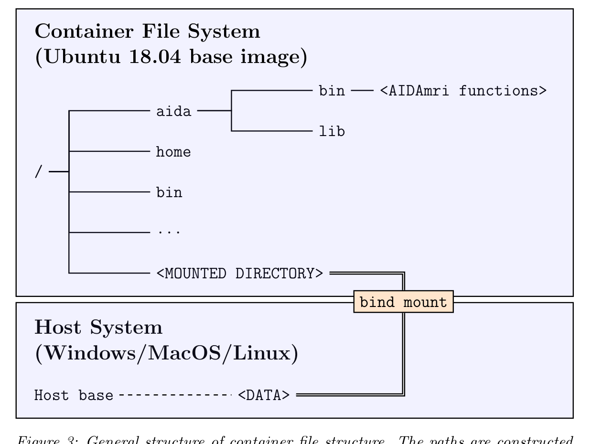
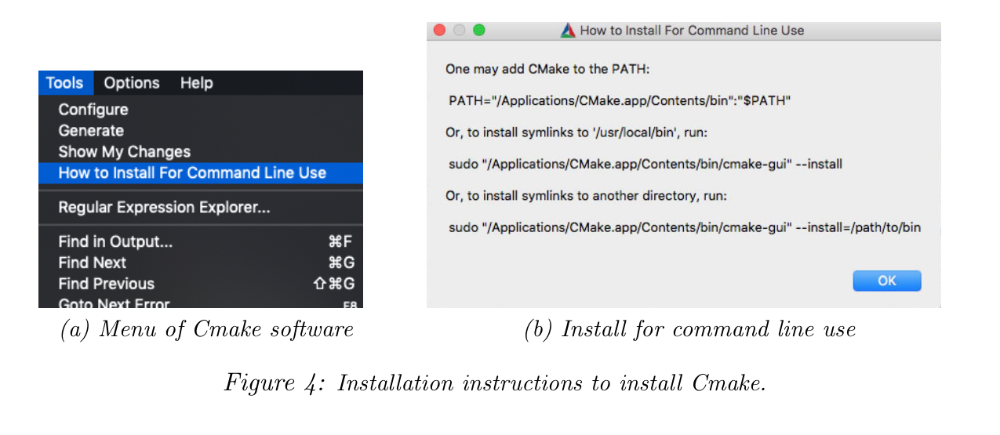

# Atlas-based Imaging Data Analysis Pipeline for Functional and Structural MRI Data

**AIDAmri v2.0**  
Aref Kalantari, Leon Scharwächter, Niklas Pallast, Michael Diedenhofen, Victor Vera Frazão, Marc Schneider, Markus Aswendt  
**Status:** September 2024  
Department of Neurology, University Hospital Cologne

## Contents

- [Introduction](#introduction)
  - [Atlas-based analysis](#atlas-based-analysis)
  - [Modular structure](#modular-structure)
- [Installation](#installation)
  - [Prerequisites](#prerequisites)
  - [Docker usage](#docker-usage)
  - [General overview](#general-overview)
  - [Creating image](#creating-image)
  - [Running container and mounting data](#running-container-and-mounting-data)
  - [Built-in installation legacy](#built-in-installation-legacy)
- [Functions](#functions)
- [Batch processing](#batch-processing)
- [Processing single files step-by-step](#processing-single-files-step-by-step)
  - [Convert raw data](#convert-raw-data)
  - [Processing of T2w and T2mapping data](#processing-of-t2w-and-t2mapping-data)
  - [Processing of ROI stroke mask data](#processing-of-roi-stroke-mask-data)
  - [Processing of DTI data](#processing-of-dti-data)
  - [Processing of fMRI data](#processing-of-fmri-data)
  - [Peri-infarct ROI analysis](#peri-infarct-roi-analysis)

## Introduction

The Atlas-based Processing Pipeline for functional and structural MRI data (**AIDAmri**) was developed for automated processing of mouse brain MRI. AIDAmri works with T2-weighted MRI (`anat`), diffusion weighted MRI or diffusion tensor imaging (`dwi`), resting-state functional MRI (`func`) and T2 map values (`t2map`).

### Atlas-based analysis

The Allen Mouse Brain Reference Atlas (ARA, CCF v3) is registered on each of these MRI data sets and is used to analyse regions of interest. Furthermore, the regions of the ARA are used as seed points for the connectivity and activity matrices. User-defined ROIs and masks can be generated separately and used for analysis, for example stroke lesion masks and peri-infarct regions.

AIDAmri comes with different atlas and template versions, which are necessary for the registration to work:

1. `annotation_50_changed_anno`: original ARA CCF v3 labels, with regions whose grey values are greater than 100,000 changed to new values starting with 2000.
2. `anno_volume_2000_rsfMRI`: atlas from item 1 with reduced number of atlas regions by selective region fusion, 96 regions in total, split between hemispheres, with the right side +2000.
3. Same as item 2 but not split.
4. Same as item 1 but split.
5. Original ARA template with 50 µm isotropic resolution.
6. Custom-made MRI template.

For the complete list of atlas labels, see:

```text
annoVolume+2000_rsfMRI.nii.txt
```



*Figure 1: Atlases included in the `/lib` folder.*

### Modular structure

The AIDAmri processing pipeline consists of several modular units designed to process structural and functional MRI data. It is possible to apply an ROI, such as a stroke lesion mask, during the processing steps.

#### Data conversion

Converts raw MRI data into the BIDS structure and NIfTI format, including all necessary header information.

#### Pre-processing

- **Image re-orientation:** aligns images to a standard orientation.
- **Bias-field correction:** corrects inhomogeneities in the MRI data using the MICO algorithm.
- **Brain extraction:** removes non-brain tissues from the images.
- **Region-of-interest segmentation:** allows the user to define specific regions for detailed analysis, such as stroke lesions.

#### Registration

- Utilizes affine and non-linear transformations to align MRI data with the Allen Brain Reference Atlas (ARA).
- Applies transformations to ensure that all imaging data are mapped accurately to a common coordinate system for further analysis.

#### DTI and rs-fMRI processing

##### DTI

- **Motion correction:** motion artifacts are corrected on a slice-by-slice basis using FSL’s MCFLIRT tool, tailored to handle rapid breathing-induced movements typical in small animals.
- **Brain extraction:** non-brain tissues are removed using a binary mask generated during brain extraction.
- **Data reconstruction:** diffusion data are reconstructed using the electrostatically optimized protocol of Jones30 with 30 gradient directions.
- **Tractography:** performed using deterministic streamline propagation, starting from random voxel positions, with fiber tracking parameters optimized for true and false fiber generation.
- **Connectivity matrix creation:** connectivity matrices are generated, representing the strength of connections between ARA-defined brain regions.

##### rs-fMRI

- **Physiological recording correction:** respiratory artifacts are identified and corrected based on recorded breathing signals.
- **Motion correction:** similar to DTI, rs-fMRI data undergo slice-wise motion correction.
- **Smoothing and filtering:** spatial smoothing and high-pass filtering, with cut-off at 0.01 Hz, are applied to reduce noise and enhance the signal.
- **Time-series extraction:** time-series data for each ARA-defined region are calculated by averaging voxel intensities over time within each region.
- **Functional connectivity analysis:** correlation of BOLD signals between brain regions is computed to assess functional connectivity.
- **Output:** produces connectivity matrices that represent structural and functional connections within the brain, which can be used for further analysis, such as graph theory applications.

## Installation

AIDAmri is distributed as a Docker image. If you prefer the built-in installation instead, see the [legacy installation](#built-in-installation-legacy) section. We highly recommend the usage of the Docker image.

### Prerequisites

The following are required to launch your AIDAmri instance:

- Docker engine
  - Getting started tutorial for Docker
- Windows only: Bash subsystem, for example Git Bash
- At least 10.6 GB free disk memory

We advise you to get comfortable with shell or command-line interface usage.

Download or clone the repository:

```bash
git clone https://github.com/aswendtlab/AIDAmri.git
```

### Docker usage

This guide introduces the usage of Docker-based containers of the AIDAmri tools for Unix/Linux-based systems, including Linux and macOS. The commands shown are written for such systems, and you may copy the commands into your shell including backslashes, as they indicate line breaks.

Windows users may use a subsystem like Git Bash to use the software. You may also use the Docker Desktop application to get access to the Docker image.

### General overview

The AIDAmri pipeline is containerized and structured as depicted in Figure 2. The `Dockerfile` located in the repository provides the installation routine for every required dependency. The `docker build` command constructs the image, meaning the installed software on your system. The `docker run` command creates a runnable instance of this image, called a container.

The container provides a command-line interface. It can be accessed by directly attaching to an interactive interface that lets you input AIDAmri commands within the isolated file system of the container, or via the `docker exec` command from your host shell.



*Figure 2: Docker architecture draft. The blue boxes within the Dockerfile box depict the main content layers. The boxes preceded with `$` are command-line codes.*

The container follows a basic Ubuntu 18.04 system, meaning that the root directory is called `/`. To share a volume between the host system and the container, bind mounts are commonly used. See [Running container and mounting data](#running-container-and-mounting-data) for further information.

When referring to the mounted volume while in the container, use the path given at mounting, for example `/<MOUNTED DIRECTORY>`. This path will likely be different on your host system.



*Figure 3: General structure of container file structure. The paths are constructed from left to right, for example the absolute path of the `bin` folder in `aida` would be `/aida/bin`. Keep in mind that `/` is its own directory. The `<MOUNTED DIRECTORY>` and `<DATA>` directories are the same but can be named differently, depending on how it was named when mounted.*

### Creating image

To initiate the image building process, open your shell to access the command-line interface. Change your directory to the cloned GitHub repository:

```bash
cd PATH/TO/AIDAmri
```

Check the folder contents with:

```bash
ls
```

A file named `Dockerfile`, as well as `fslinstaller_mod.py`, a `bin/` folder and a `lib/` folder should be located in this directory. Then launch the Docker daemon to build the image:

```bash
docker build -t aidamri:latest -f Dockerfile .
```

The created image is a template for running containers and instantiating the pipeline. Be aware that the period at the end is part of the command and refers to the corresponding directory.

The `-t` flag sets the name and tag of the image. In this example, it is called `aidamri` and tagged `latest`. You may change the name and tag, but remember to change them accordingly in later steps that invoke the image. The `-f` flag refers to the `Dockerfile` in the current directory.

You only need to run the building process once initially or after updating the GitHub repository after new changes were made. If an update occurred, the building process will only update changed layers, so the process will not take as long as the initial build.

### Running container and mounting data

Before running a container, make sure you know exactly where the data you wish to process is located on your host system. The container will be an instance written from the built image and serves as an environment for using the AIDAmri pipeline.

To run the container, enter the following command:

```bash
docker run -dit \
  --name aidamri \
  --mount type=bind,source=PATH/TO/DATA,target=/aida/DATA \
  aidamri:latest
```

The `-dit` flags start the container in detached mode (`d`) and interactive mode (`it`). Alternatively, you can directly enter the container environment by only using the `-it` flag. With the `--name` flag, you give your container a name. In this case it is called `aidamri`.

The image name and the container name are independent. It is recommended to give your container a different name from the image to avoid confusion. If you wish to use more than one running container instance, for example to process multiple datasets simultaneously, each container needs a different name.

Bind mounts create a reference to a given directory, allowing the container to access and process data on the host system. In this case, it allows the pipeline to process MRI data without copying or reallocating the data.

The `--mount` flag with the `type=bind` argument grants the container access to the target directory. Use the absolute path at the `source` placeholder. Do not use relative paths. Within the container environment, a working directory called `/aida/` was created. It is recommended to allocate your reference path within this directory, for example `/aida/DATA`.

Pass the name and tag of your image, here `aidamri:latest`, at the end of the command line. After initializing, an ID will appear and Docker Desktop should show the running container. You can also check whether the container is running by typing:

```bash
docker container ls
```

To enter the running container, use:

```bash
docker attach aidamri
```

Windows users can leave a running container without stopping it by pressing `CTRL+P` and `CTRL+Q` consecutively. Alternatively, typing `exit` will stop the container.

Use the following to re-run the container:

```bash
docker start aidamri
```

Type `stop` instead of `start` to stop an already running container.

When successfully attached, the shell prompt will look like this:

```text
root@<SOME NUMBERS AND CHARACTERS>:/aida#
```

The number shows the first part of the container ID. From here, use the AIDAmri commands as explained in the usage sections. As a start, change your directory to the binary folder and run the help command:

```bash
cd bin/
python batchProg.py -h
```

Alternatively, use `docker exec` to pipe a command into the running container without entering its interactive environment. For example, to run the `batchProg` help page:

```bash
docker exec -w /aida/bin aidamri \
  python batchProg.py -h
```

The `-w` flag acts as a directory change by inputting the directory where `batchProg` is located, `/aida/bin`.

### Built-in installation legacy

AIDAmri can be installed without Docker on your host machine. Be advised that the installation process is tedious and error prone due to the different dependencies and their installation processes.

1. Download the folders `/bin` and `/lib` by using the provided repository link. `/bin` and `/lib` should be located in the same directory.

   Alternatively, clone the repository:

   ```bash
   git clone https://github.com/Aswendt-lab/AIDAmri
   ```

   The folder `/bin` contains the Python scripts necessary for all preprocessing steps. The folder `/lib` contains information about six atlases. Please do not change these files, because changes could influence access from the Python scripts.

2. Download and install the appropriate DSI Studio and copy the install path into:

   ```text
   .../bin/3.2 DTIConnectivity/dsi_studioPath.txt
   ```

   On Ubuntu, if an error says that `libQt6Charts.so.6` could not be found, run:

   ```bash
   sudo apt install libqt6charts6-dev
   ```

3. Download FSL installer 3.3.0. To install FSL, use:

   ```bash
   python3 fslinstaller.py -V 5.0.11
   ```

4. Download and install the latest version of CMake.

   - Unpack the downloaded archive and switch to the directory using `cd`.
   - Run the following command to install CMake:

   ```bash
   ./bootstrap && make && sudo make install
   ```

   

   *Figure 4: Installation instructions to install CMake.*

5. Download and install Python 3.6 or higher using Anaconda and run:

   ```bash
   pip install nipype==1.1.2 lmfit==0.9.11 progressbar2==3.38.0 \
     nibabel shutil
   ```

   Anaconda will tell you if additional packages are necessary. We recommend installing AIDAmri in a separate Anaconda environment. Alternatively, use `requirements.txt` from the AIDAmri Git repository to install the dependencies. Open the terminal in the folder where the requirements file is located and run:

   ```bash
   pip install --upgrade pip && pip install -r requirements.txt
   ```

6. Install NiftyReg by conducting the following steps:

   a. Generate your source folder:

   ```text
   .../NiftyReg/niftyreg_source
   ```

   b. Download NiftyReg from Git by replacing `<path>` with your personal path:

   ```bash
   git clone \
     git://git.code.sf.net/p/niftyreg/git \
     <path>/niftyreg_source
   ```

   c. Change into the folder:

   ```bash
   cd <path>/niftyreg_source
   ```

   d. Run:

   ```bash
   git reset --hard 83d8d1182ed4c227ce4764f1fdab3b1797eecd8d
   ```

   e. Follow the described NiftyReg installation steps.

## Functions

List of functions:

- `PV2NIfTiConverter`: Bruker to NIfTI converter.
- `T2PreProcessing`: T2w MRI preprocessing including brain extraction, bias field correction and atlas registration.
- `DTIPreprocessing`: DTI preprocessing including brain extraction, bias field correction and atlas registration.
- `fMRIPreProcessing`: fMRI preprocessing including brain extraction, bias field correction and atlas registration.
- `T2Processing`: stroke mask calculations across all subjects per group, incidence mapping and SNR calculations.
- `DTIConnectivity`: whole-brain fiber tracking using DSI Studio and calculation of diffusion measures, FA, AD, RD and MD, for every brain region.
- `DTIdata_extract`: creates a `.txt` file containing DTI values from all brain regions.
- `fMRIActivity`: functional connectivity analysis for all atlas regions.
- `T2mapPreProcessing`: T2 map preprocessing.
- `ROI_analysis`: analysis of T2w, DTI and rs-fMRI with user-defined atlas regions, for example peri-infarct regions around the stroke lesion.

All program examples are listed only with the mandatory input parameters. For more details or help, call:

```bash
python <command> -h
```

The command-line examples use the identifier `testData<No.>.nii.gz` and can be identically applied to other data. The test data are freely available at DOI `10.12751/g-node.70e11f`.

After a successful download, you can choose either to process single files manually or automate the processing for the whole dataset. In both cases, processing includes file conversion from the raw Bruker format into NIfTI format, several preprocessing steps and registration with the Allen Brain Reference Atlas. The functions in `/bin` are named according to the MRI sequence to be processed, such as `T2`, `DTI` and `fMRI`.

> [!IMPORTANT]
> Process your T2 data first so that preprocessing of DTI, fMRI and T2 map data works correctly.

## Batch processing

AIDAmri provides functions for data conversion and batch processing. Complete processing requires two scripts:

1. `conv2Nifti_auto.py` creates a new project folder, converts all files to NIfTI format and stores them in the new project folder.
2. `batchProc.py` applies preprocessing steps and registration with the atlas.

> [!NOTE]
> If multiple reconstructions exist, conversion will only use the first folder correctly. The test data set is already converted into NIfTI format, so only the second script needs to be applied.

In general, raw Bruker data must be in the following structure for the first script to work:

```text
projectfolder/days/subjects/
```

To convert the whole project folder into NIfTI format, open the terminal and change the directory to the `/bin` folder of the AIDAmri installation:

```bash
cd <path to AIDAmri>/bin
```

Start Bruker to NIfTI conversion:

```bash
python conv2Nifti_auto.py -i /path/to/raw_dataset -o /path/to/output
```

This script automatically finds all raw Bruker datasets saved within the input path. By default, the output is saved in:

```text
/path/to/raw_dataset/proc_data
```

You can specify the output directory via the `-o` flag.

After successful Bruker to NIfTI conversion, the second script can be applied to the new project folder `proc_data`. The data need to be ordered in BIDS format like the output of `conv2Nifti_auto.py`:

```text
projectfolder/sub-/ses-/datatype
```

> [!WARNING]
> Batch processing may slow down the system depending on the CPU load-out. Use the `-cpu` or `-e cpu` flag to specify CPU usage. Run `python batchProg.py -h` for more information.

Example:

```bash
python batchProc.py -i /path/to/proc_data \
  -t anat dwi func t2map -s Baseline P3 P12 -stc False
```

This script runs every necessary script for preprocessing, registration and processing steps. You can specify which data types (`-t`) and sessions (`-s`) to compute. You can also specify whether slice-time correction should be performed on the data. By default, the `-stc` flag is set to `False`, and it is optional to set this parameter.

You do not need to specify data types and sessions. If no `-t` and no `-s` flag are given, every data type and session of every subject will be processed.

> [!IMPORTANT]
> The scripts executed by `batchProc.py` are related to each other. Therefore, `anat` always needs to be specified before `dwi`.

Depending on the size of your project, this process may take a while. After finishing, the project folder is ready for network graph analysis, for example using AIDAconnect.

Further information can be accessed with:

```bash
python batchProc.py -h
```

## Processing single files step-by-step

### Convert raw data

Convert Bruker raw data to NIfTI files by specifying the folder containing all raw folders of each scan.

> [!NOTE]
> If multiple reconstructions exist, conversion will only use the first folder correctly. A file with exactly the same name is created in the given input folder. It contains all sorted NIfTI files. The raw data should have the same orientation as the example dataset.

```bash
python pv_conv2Nifti.py -i .../testData
```

Move the newly generated file to a new project folder if you want to separate raw Bruker files from processed NIfTI files. We recommend the following folder structure, especially if you want to use AIDAconnect for graph analysis:

```text
projectfolder/days/groups/subjects/data/
```

### Processing of T2w and T2mapping data

Apply reorientation, bias field correction and brain extraction to the T2w data set. The automatically attached endings of the processed filenames indicate which steps have been performed.

> [!IMPORTANT]
> Brain extraction should be of good quality and must be manually checked or corrected by adapting the default parameter.

```bash
python preProcessing_T2.py -i .../testData/T2w/testData.5.1.nii.gz
```

The next step includes registration of the Allen Brain Reference Atlas with the brain-extracted T2 dataset. Check the registration result, for example by superimposing the brain-extracted file with the atlas annotations, ending with `...Anno.nii.gz`.

There is an option to segment an additional region of interest, such as the stroke lesion. You can segment the region using the brain-extracted dataset as reference, ending with `...BET.nii.gz`. We recommend conducting this step with ITK-SNAP. The saved file should end with:

```text
...Stroke_mask.nii.gz
```

Run registration:

```bash
python registration_T2.py -i .../testData/T2w/testDataBiasBet.nii
```

To improve registration, try to optimize the brain extraction and generated mask, for example manually using ImageJ. Then run the registration again.

If you previously defined a region of interest, such as a stroke lesion, it is possible to calculate the region size and segmented parental atlas regions. Here, the segmented region `.../Stroke_mask.nii.gz` is overlaid with the Allen Brain Reference Atlas and saved in the file `...Anno_mask.nii.gz`. Use the path to `.../T2w` as input.

```bash
python getIncidenceSize_par.py -i .../testData/T2w
python getIncidenceSize.py -i .../testData/T2w
```

The results, such as affected regions and ROI volume, are stored in the folder `.../T2w` in the following files:

```text
*affectedRegions.csv
*affectedRegions.nii.gz
*labelCount_par.mat
```

### Processing of ROI stroke mask data

From masks drawn on the T2-weighted images, it is possible to determine both the incidence map and the size of affected regions. For example, if a `day1` folder contains multiple `Mouse 1` to `Mouse 15` folders and the processed T2 data are in those folders, the command would be:

```bash
python getIncidenceMap.py -i .../day1 -s "Mouse*"
```

It is also possible to determine the region size as voxels and volume in mm³:

```bash
python getRegionSize_par.py -i .../T2w
```

### Processing of DTI data

The DTI processing procedure includes dimension reduction, bias correction, threshold application and subsequent brain extraction. The endings on the filenames indicate which steps have been performed.

```bash
python preProcessing_DTI.py -i .../DTI/testData.7.1.nii.gz
```

The next step includes registration of the Allen Brain Reference Atlas with the brain-extracted DTI dataset. For processing a reference stroke mask, two options are available:

1. Registration of a reference mask that is related to another dataset or day, for example to always use the same mask. Append `-r <filename of ref>`.
2. Otherwise, the algorithm automatically uses the corresponding reference mask from the respective subject folder. If no mask is defined, the registration proceeds without a mask.

```bash
python registration_DTI.py -i .../DTI/testDataSmoothMicoBet.nii.gz
```

Connectivity is finally calculated using DSI Studio. All connectivity matrices are based on the reference atlas.

```bash
python dsi_main.py -i .../DTI/testData.7.1.nii.gz
```

The connectivity matrices of the parental ARA, the original ARA and the related ROI are stored in the folder `.../DTI/connectivity` as `.txt` and `.mat` files. DSI Studio differentiates between matrices that count how many fibers pass through and end in each region.

The adjacency matrices can be visualized using the related plot function:

```bash
python plotDTI_mat.py -i .../testData/DTI/connectivity/testData*.connectivity.mat
```

The folder `.../DTI/DSI_studio` also contains diffusion value maps, for example FA maps, registered with the atlas. This data can be extracted and saved as `.txt` with the region name and corresponding FA, RD, MD and AD values using:

```bash
python DTIdata_extract.py image_file roi_file
```

Use this command in the `3.2.1 DTIdata_extract` folder. To iteratively process all subjects, use the `iterativeRun.py` function.

### Processing of fMRI data

The fMRI processing is roughly comparable to preprocessing of DTI datasets.

> [!IMPORTANT]
> Brain extraction should be of good quality and must be manually checked or corrected by adapting the given parameters.

```bash
preProcessing_fMRI.py -i .../fMRI/testData.6.1.nii.gz
```

The next step includes registration of the Allen Brain Reference Atlas with the brain-extracted fMRI dataset. The result is a variety of files. An impression of the registration can be obtained by superimposing the brain-extracted file with the annotations of the Allen Brain, ending with `...Anno.nii.gz`.

```bash
python registration_fMRI.py -i .../testData/fMRI/testSmoothBet.nii
```

If physiological data are not available, the step will be conducted without the included regression. All activity matrices are based on the reference atlas.

```bash
python process_fMRI -i .../fMRI/testData.6.1.nii.gz
```

The activity matrices of the parental Atlas and original Atlas are stored in the folder `.../fMRI/regr` as `.txt` and `.mat` files with the prefixes `MasksTCs.` and `MasksTCsSplit.`.

The related adjacency matrices can be visualized using the related plot function:

```bash
python plotfMRI_mat.py -i .../testData/fMRI/regr/MasksTCsSplit*.mat
```

### Peri-infarct ROI analysis

You can create custom peri-infarct masks to further analyze stroke-related regions. Go to the folder:

```text
bin/4.1 ROI analysis
```

Open `proc_tools.py` with an editor that can open Python files. Adjust all directories, paths and further specifications as described in the script.

To decide which regions to include in the peri-infarct region, modify:

```text
cortex_labels_1.txt
cortex_labels_2.txt
```

For the full list of atlas labels, see:

```text
../lib/annoVolume+2000_rsfMRI.nii.txt
```

Proceed with the scripts in order from 1 to 4.

The first script creates peri-infarct masks for all time points:

```bash
python 01_dilate_mask_process.py
```

The second script aligns the peri-infarct masks in the rs-fMRI and DTI space:

```bash
python 02_apply_xfm_process.py
```

The result of the third script depends on the imaging type:

- For rs-fMRI, a MATLAB file is created which contains two text files:
  1. For each region, one column with the averaged rs-fMRI time series.
  2. The atlas label names.
- For DTI, a modified atlas labels file is created which includes individually shaped peri-infarct brain regions. These newly generated regions replace the original regions in the file.

```bash
python 03_create_seed_rois_process.py
```

The fourth script is not mandatory, but is a helper tool to compare the number of voxels included in the peri-infarct region for each subject.

```bash
python 04_examine_rois.py
```

> [!WARNING]
> The scripts for peri-infarct ROI analysis are provided for analysis of time point 7 only, for example 7 days post-stroke. For other time points, manual modifications are necessary.
