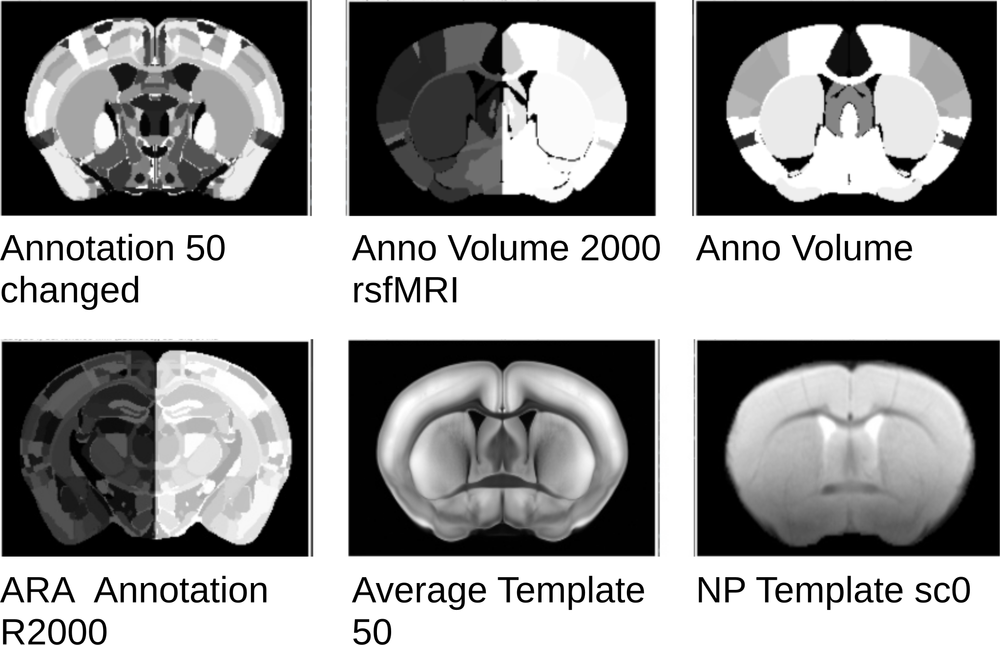
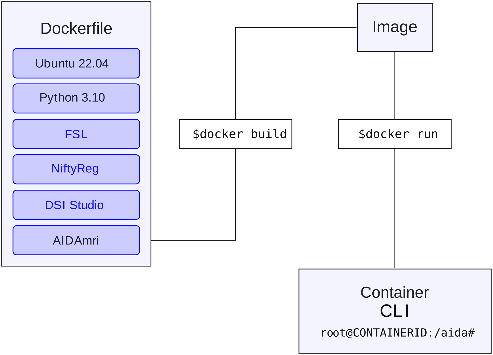
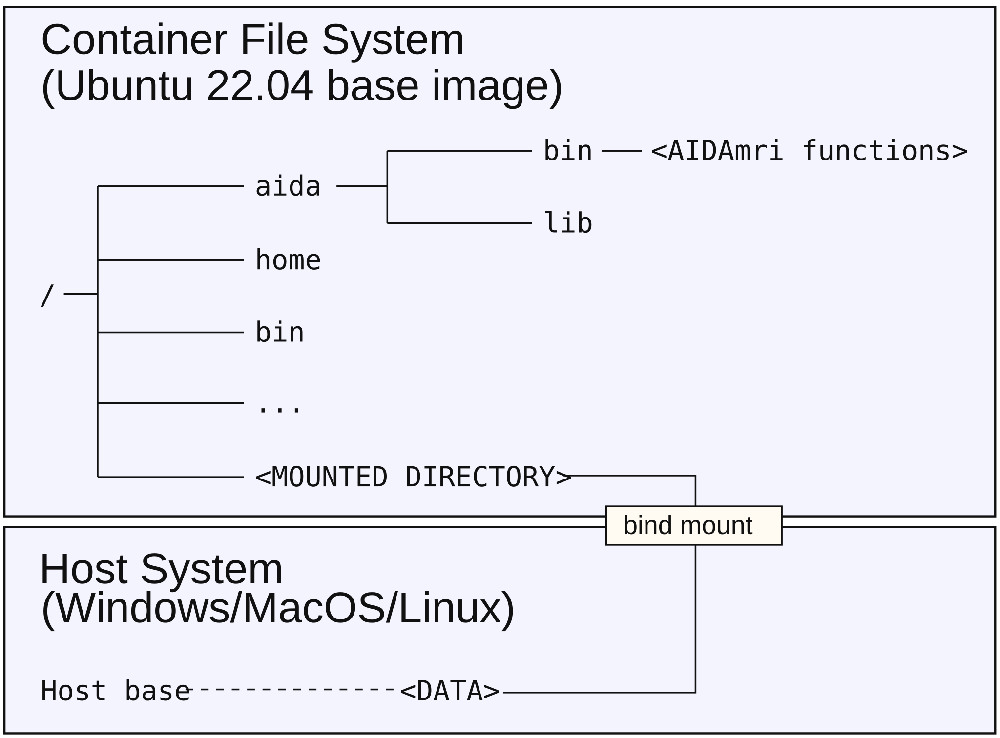

# Atlas-based Imaging Data Analysis Pipeline for Functional and Structural MRI Data

**AIDAmri v3.0**

Julian Cramer, Aref Kalantari, Leon Scharwächter, Niklas Pallast, Michael Diedenhofen, Victor Vera Frazão, Marc Schneider, Markus Aswendt

**Status:** July 2026

Department of Neurology, University Hospital Frankfurt, Germany

> [!NOTE]
> View this manual online on GitHub, in a Python IDE or in a text editor that supports Markdown formatting for better readability.
>
> An older interactive workshop notebook is available as [`AIDAmri_workshop.ipynb`](docs/AIDAmri_workshop.ipynb). It can still be useful as a hands-on walkthrough, but it is outdated and may not reflect the current AIDAmri v3.0 Docker image, command-line options, or file naming conventions.

## Contents

- [Introduction](#introduction)
  - [Atlas-based analysis](#atlas-based-analysis)
  - [Modular structure](#modular-structure)
- [Installation](#installation)
  - [Prerequisites](#prerequisites)
  - [Docker usage](#docker-usage)
  - [General overview](#general-overview)
  - [Creating image](#creating-image)
  - [Running container and mounting data](#running-container-and-mounting-data)
- [Functions](#functions)
- [Batch processing](#batch-processing)
- [Processing single files step-by-step](#processing-single-files-step-by-step)
  - [Convert raw data](#convert-raw-data)
  - [Preprocessing of anatomical data](#preprocessing-of-anatomical-data)
  - [Registration of anatomical data](#registration-of-anatomical-data)
  - [Processing of anatomical data](#processing-of-anatomical-data)
  - [Processing of ROI stroke mask data](#processing-of-roi-stroke-mask-data)
  - [Preprocessing of T2 map data](#preprocessing-of-t2-map-data)
  - [Registration of T2 map data](#registration-of-t2-map-data)
  - [Processing of T2 map data](#processing-of-t2-map-data)
  - [Preprocessing of DTI data](#preprocessing-of-dti-data)
  - [Registration of DTI data](#registration-of-dti-data)
  - [Processing of DTI data](#processing-of-dti-data)
  - [Preprocessing of fMRI data](#preprocessing-of-fmri-data)
  - [Registration of fMRI data](#registration-of-fmri-data)
  - [Processing of fMRI data](#processing-of-fmri-data)
  - [Peri-infarct ROI analysis](#peri-infarct-roi-analysis)

<h2 id="introduction">Introduction <a href="#contents"><span style="font-size: 1.35em;">↑</span></a></h2>

The Atlas-based Processing Pipeline for functional and structural MRI data (**AIDAmri**) was developed for automated processing of mouse brain MRI. AIDAmri works with T2-weighted MRI (`anat`), diffusion weighted MRI or diffusion tensor imaging (`dwi`), resting-state functional MRI (`func`) and T2 map values (`t2map`).

<h3 id="atlas-based-analysis">Atlas-based analysis <a href="#contents"><span style="font-size: 1.35em;">↑</span></a></h3>

The Allen Mouse Brain Reference Atlas (ARA, CCF v3) is registered on each of these MRI data sets and is used to analyse regions of interest. Furthermore, the regions of the ARA are used as seed points for the connectivity and activity matrices. User-defined ROIs and masks can be generated separately and used for analysis, for example stroke lesion masks and peri-infarct regions.

AIDAmri comes with different atlas and template versions, which are necessary for the registration to work:

1. `annotation_50_changed_anno`: original ARA CCF v3 labels, with regions whose grey values are greater than 100,000 changed to new values starting with 2000.
2. `anno_volume_2000_rsfMRI`: atlas from item 1 with reduced number of atlas regions by selective region fusion, 96 regions in total, split between hemispheres, with the right side +2000.
3. Same as item 2 but not split.
4. Same as item 1 but split.
5. Original ARA template with 50 µm isotropic resolution.
6. Custom-made MRI template.

For the complete list of atlas labels, see:

```text
annoVolume+2000_rsfMRI.nii.txt
```

<p align="center">
  
</p>

<p align="center">
  <em>Figure 1: Atlases included in the /lib folder.</em>
</p>

<h3 id="modular-structure">Modular structure <a href="#contents"><span style="font-size: 1.35em;">↑</span></a></h3>

The AIDAmri processing pipeline consists of several modular units designed to process structural and functional MRI data. It is possible to apply an ROI, such as a stroke lesion mask, during the processing steps.

#### Data conversion

Converts raw MRI data into the BIDS structure and NIfTI format, including all necessary header information.

#### Pre-processing

- **Image re-orientation:** aligns images to a standard orientation.
- **Bias-field correction:** corrects inhomogeneities in the MRI data using the MICO algorithm.
- **Brain extraction:** removes non-brain tissues from the images.
- **Region-of-interest segmentation:** allows the user to define specific regions for detailed analysis, such as stroke lesions.

#### Registration

- Utilizes affine and non-linear transformations to align MRI data with the Allen Brain Reference Atlas (ARA).
- Applies transformations to ensure that all imaging data are mapped accurately to a common coordinate system for further analysis.

#### DTI and rs-fMRI processing

##### DTI

- **Motion correction:** motion artifacts are corrected on a slice-by-slice basis using FSL’s MCFLIRT tool, tailored to handle rapid breathing-induced movements typical in small animals.
- **Brain extraction:** non-brain tissues are removed using a binary mask generated during brain extraction.
- **Data reconstruction:** diffusion data are reconstructed using the electrostatically optimized protocol of Jones30 with 30 gradient directions.
- **Tractography:** performed using deterministic streamline propagation, starting from random voxel positions, with fiber tracking parameters optimized for true and false fiber generation.
- **Connectivity matrix creation:** connectivity matrices are generated, representing the strength of connections between ARA-defined brain regions.

##### rs-fMRI

- **Physiological recording correction:** respiratory artifacts are identified and corrected based on recorded breathing signals.
- **Motion correction:** similar to DTI, rs-fMRI data undergo slice-wise motion correction.
- **Smoothing and filtering:** spatial smoothing and high-pass filtering, with cut-off at 0.01 Hz, are applied to reduce noise and enhance the signal.
- **Time-series extraction:** time-series data for each ARA-defined region are calculated by averaging voxel intensities over time within each region.
- **Functional connectivity analysis:** correlation of BOLD signals between brain regions is computed to assess functional connectivity.
- **Output:** produces connectivity matrices that represent structural and functional connections within the brain, which can be used for further analysis, such as graph theory applications.

<h2 id="installation">Installation <a href="#contents"><span style="font-size: 1.35em;">↑</span></a></h2>

AIDAmri is distributed as a Docker image. Docker is a platform that allows you to run applications in isolated environments called containers. This means that all the software dependencies and configurations needed to run AIDAmri are included in the Docker image, making it easier to set up and use the pipeline without worrying about compatibility issues.

The current Docker image is based on Ubuntu 22.04 and runs Python 3.10 in a virtual environment at `/opt/env`. It includes FSL 5.0.11, NiftyReg from the pinned commit `83d8d1182ed4c227ce4764f1fdab3b1797eecd8d`, DSI Studio 2025.04.16, ANTs 2.6.2, `bet4animal` and `immv`. Python packages are installed from `requirements.txt` with reproducible version constraints from `constraints.txt`.

<h3 id="prerequisites">Prerequisites <a href="#contents"><span style="font-size: 1.35em;">↑</span></a></h3>

The following are required to launch your AIDAmri instance:

- Docker engine
  - Getting started tutorial for Docker
- Windows only: Bash subsystem, for example Git Bash
- At least 20 GB free disk memory

We advise you to get comfortable with shell or command-line interface usage.

Download or clone the repository:

```text
git clone https://github.com/aswendtlab/AIDAmri.git
```

<h3 id="docker-usage">Docker usage <a href="#contents"><span style="font-size: 1.35em;">↑</span></a></h3>

This guide introduces the usage of Docker-based containers of the AIDAmri tools for Unix/Linux-based systems, including Linux and macOS. The commands shown are written for such systems, and you may copy the commands into your shell including backslashes, as they indicate line breaks.

Windows users may use a subsystem like Git Bash to use the software. You may also use the Docker Desktop application to get access to the Docker image.

<h3 id="general-overview">General overview <a href="#contents"><span style="font-size: 1.35em;">↑</span></a></h3>

The AIDAmri pipeline is containerized and structured as depicted in Figure 2. The `Dockerfile` located in the repository provides the installation routine for every required dependency. The `docker build` command constructs the image, meaning the installed software on your system. The `docker run` command creates a runnable instance of this image, called a container.

The container provides a command-line interface. It can be accessed by directly attaching to an interactive interface that lets you input AIDAmri commands within the isolated file system of the container, or via the `docker exec` command from your host shell.

<p align="center">
  
</p>

<p align="center">
  <em>Figure 2: Docker architecture draft. The blue boxes within the Dockerfile box depict
the main content layers. The boxes preceded with an $ are command line codes.
Click on texts within the boxes for further information.</em>
</p>

The container is based on Ubuntu 22.04, and its root directory is called `/`. To share a volume between the host system and the container, bind mounts are commonly used. See [Running container and mounting data](#running-container-and-mounting-data) for further information.

When referring to the mounted volume while in the container, use the path given at mounting, for example `/<MOUNTED DIRECTORY>`. This path will likely be different on your host system.

<p align="center">
  
</p>

<p align="center">
  <em>Figure 3: General structure of container file structure. The paths are constructed
  from left to right, for example the absolute path of the <code>bin</code> folder in
  <code>aida</code> would be <code>/aida/bin</code>. Keep in mind that <code>/</code>
  is its own directory. The &lt;MOUNTED DIRECTORY&gt; and &lt;DATA&gt; directories
  are the same but can be named differently, depending on how the mounted directory
  was named.</em>
</p>

<h3 id="creating-image">Creating image <a href="#contents"><span style="font-size: 1.35em;">↑</span></a></h3>

Before you can build the Docker image, you need to open a terminal. In the terminal, change into the AIDAmri repository folder that you previously cloned from GitHub:

```text
cd PATH/TO/AIDAmri
```

Replace `PATH/TO/AIDAmri` with the actual path to your local AIDAmri folder.

Check the folder contents with:

```text
ls
```

A file named `Dockerfile`, as well as the `install/`, `bin/` and `lib/` folders should be located in this directory. Then launch the Docker daemon to build the image:

```text
docker build -t aidamri:latest -f Dockerfile .
```

The created image is a template for running containers and instantiating the pipeline. Be aware that the **period** at the end is part of the command and refers to the corresponding directory.

The `-t` flag sets the name and tag of the image. In this example, it is called `aidamri` and tagged `latest`. You may change the name and tag, but remember to change them accordingly in later steps that invoke the image. The `-f` flag refers to the `Dockerfile` in the current directory.

<details>
<summary><strong>Side note: source information stored in the Docker image</strong></summary>

During the Docker build, AIDAmri writes repository provenance information to `/aida/build/AIDAmri_git_information.txt` inside the image. The file records the Git commit, branch, whether the build context had uncommitted changes, the commit author and the project Git user when available. Most users do not need to change anything here.

If you want the Docker build to include your local Git user name, pass it explicitly:

```text
docker build \
  --build-arg AIDAMRI_GIT_CONFIG_USER="$(git config user.name)" \
  -t aidamri:latest \
  -f Dockerfile .
```

When a container starts and `/aida/DATA` exists, the entrypoint copies this information to:

```text
/aida/DATA/AIDAmri_git_information.txt
```

This information will help you to identify the source of the AIDAmri version used for processing, even if you later update the Git repository or rebuild the image.

</details>

You only need to build the Docker image once during the initial installation.

After updating the GitHub repository, for example with `git pull`, you should rebuild the image so that the new code is included.

Docker usually uses its build cache during this process. This means that unchanged parts of the image are reused, and only the layers affected by the update are rebuilt. Therefore, rebuilding the image after a code update is usually faster than the initial build.

Keep in mind that existing containers are not updated automatically. To use the updated image, stop and remove the old container, then start a new container from the rebuilt image.

<h3 id="running-container-and-mounting-data">Running container and mounting data <a href="#contents"><span style="font-size: 1.35em;">↑</span></a></h3>

Before starting the container, check where your MRI data is stored on your computer. You will need the **absolute path** to this folder.
To start an AIDAmri container and make your data available inside it, run:

```text
docker run -dit \
    --platform linux/amd64 \
    --name aidamri_container \
    --mount type=bind,source=PATH/TO/DATA,target=/aida/DATA \
    aidamri:latest
```

The command performs the following function:
`docker run` starts a new container from the AIDAmri Docker image.
`-dit` starts the container in the background while keeping it interactive. This means the container keeps running, and you can enter it later.

`--platform linux/amd64` explicitly selects the Linux AMD64 platform for which the image was built. This is particularly relevant on ARM-based hosts, such as Apple Silicon Macs or Windows-on-ARM devices, where Docker runs the image using AMD64 emulation. On standard Intel or AMD systems, this option is usually not required.

`--name aidamri_container` gives the container a name. The container name is independent from the image name. In this example, the image is called `aidamri:latest`, while the container is called `aidamri_container`. If you wish to use more than one running container instance, for example to process multiple datasets simultaneously, each container needs a different name.

`--mount type=bind,source=PATH/TO/DATA,target=/aida/DATA` connects a folder from your computer to a folder inside the container. This is called a bind mount. It allows AIDAmri to access and process your MRI data without copying it into the container.

`source=PATH/TO/DATA` is the data folder where your data that you want to process is stored on your computer. Always use an absolute path here!
`target=/aida/DATA` is the location where the same folder will appear inside the container. So you do not need to use the absolute path inside the container, but can refer to the mounted data with `/aida/DATA`.

`aidamri:latest` is the Docker image that is used to create the container.

After running the command, Docker will print a container ID. You can check whether the container is running with:

```text
docker container ls
```

To enter the running container, use:

```text
docker attach aidamri_container
```

Windows users can leave a running container without stopping it by pressing `CTRL+P` and `CTRL+Q` consecutively. Alternatively, typing `exit` will stop the container.

Use the following to re-run the container:

```text
docker start aidamri_container
```

Type `stop` instead of `start` to stop an already running container.

After successfully attaching to the container, your terminal should look similar to this:

```text
root@<SOME NUMBERS AND CHARACTERS>:/aida#
```

The number-and-letter combination is the first part of the container ID.

You are now inside the running AIDAmri container.

From here, you can use the AIDAmri commands described in the usage sections.

The container entrypoint copies the build provenance file into `/aida/DATA` at startup. `batchProc.py` also copies available AIDAmri Git information into the processed project folder so batch outputs remain linked to the image/source revision used for processing.

As a first test, change into the `bin/` folder and open the help page of the batch processing script:

```text
cd bin/
python batchProc.py -h
```

If the help page is displayed, the container is working and AIDAmri can be used.

Alternatively, you can use `docker exec` to run a command inside the container without entering the container shell.

For example, to open the help page of `batchProc.py`, run:

```text
docker exec -w /aida/bin aidamri_container \
  python batchProc.py -h
```

Here, `-w /aida/bin` sets the working directory inside the container to `/aida/bin`.

<h2 id="functions">Functions <a href="#contents"><span style="font-size: 1.35em;">↑</span></a></h2>

List of functions and script groups:

- `conv2Nifti_auto.py`: batch conversion of raw Bruker ParaVision data to BIDS-like NIfTI output folders.
- `PV2NIfTiConverter/`: ParaVision-to-NIfTI conversion scripts used by `conv2Nifti_auto.py`, including DTI sidecar generation for `.bval` and `.bvec` files.
- `batchProc.py`: batch processing entry point for converted datasets. It runs the selected preprocessing, registration and processing steps for the requested data types and sessions.
- `2.1_T2PreProcessing/`: T2w preprocessing, including reorientation, smoothing, bias-field correction, brain extraction and atlas registration.
- `2.2_DTIPreProcessing/`: DTI preprocessing, including b0 averaging, motion correction, smoothing, bias-field correction, brain extraction and atlas registration.
- `2.3_fMRIPreProcessing/`: rs-fMRI preprocessing, including slice-time correction, motion correction, smoothing and atlas registration.
- `3.1_T2Processing/`: T2w analysis scripts for stroke mask statistics, incidence maps, incidence sizes and SNR calculations.
- `3.2_DTIConnectivity/`: DTI reconstruction and whole-brain fiber tracking with DSI Studio, including connectivity matrix generation and matrix plotting.
- `3.2.1_DTIdata_extract/`: extraction of region-wise DTI measures such as FA, AD, RD and MD from registered atlas regions, including iterative batch helpers.
- `3.3_fMRIActivity/`: rs-fMRI activity and connectivity analysis, including seed ROI creation, regression tables, mean time-series extraction, correlation matrices and matrix plotting.
- `4.1_T2mapPreProcessing/`: T2 map preprocessing, atlas registration and extraction of region-wise T2 map values.
- `5.1_ROI_analysis/`: ROI-based analyses for user-defined regions, for example peri-infarct regions around stroke lesions, including mask dilation, transform application, seed ROI creation and ROI inspection.
- `helper_tools/`: additional utilities for data preparation and quality control, including naming cleanup, batch reorientation, fieldmap JSON updates, stroke mask distribution, source-data plotting, atlas region size summaries and QC report helpers.
- `helper_tools/adjustbvecRep.py`: helper for adjusting repeated b-vector files in DTI datasets.

All program examples are listed only with the mandatory input parameters. For more details or help, call:

```text
python <command> -h
```

The command-line examples use the identifier `testData<No.>.nii.gz` and can be identically applied to other data. The test data are freely [**here**](https://next.hessenbox.de/index.php/s/3tRzc5rCC8GWCAc).

After a successful download, you can choose either to process single files manually or automate the processing for the whole dataset. In both cases, processing includes file conversion from the raw Bruker format into NIfTI format, several preprocessing steps and registration with the Allen Brain Reference Atlas. The functions in `/bin` are named according to the MRI sequence to be processed, such as `T2`, `DTI` and `fMRI`.

> [!IMPORTANT]
> Process your T2 data first so that preprocessing of DTI, fMRI and T2 map data works correctly.

<h2 id="batch-processing">Batch processing <a href="#contents"><span style="font-size: 1.35em;">↑</span></a></h2>

AIDAmri provides functions for data conversion and batch processing. Complete processing requires two scripts:

1. `conv2Nifti_auto.py` converts all files to NIfTI format and stores them in the new `proc_data` folder.
2. `batchProc.py` applies preprocessing steps and registration with the atlas.

> [!NOTE]
> If a Bruker scan contains multiple reconstruction folders, verify the converted output carefully because the converter may select only one reconstruction. The test dataset is already converted into NIfTI format (see the `nifti` folder), so only the second script needs to be applied.

For batch conversion, place all raw Bruker subject datasets directly in one input directory without an additional nested folder structure:

```text
raw_data/
├── subject_dataset_1/
├── subject_dataset_2/
└── subject_dataset_3/
```

To convert the whole project folder into NIfTI format, open the terminal and change the directory to the `/bin` folder of the AIDAmri installation:

```text
cd <path to AIDAmri>/bin
```

Start Bruker to NIfTI conversion:

```text
python conv2Nifti_auto.py -i /path/to/raw_dataset -o /path/to/output
```

This script automatically finds all raw Bruker datasets saved within the input path. You can specify the output directory via the `-o` flag. Without the `-o` flag, the output is saved next to the input directory:

```text
/path/to/proc_data
```

> [!NOTE]
> If conversion produces incorrect subject or study names because the corresponding values in the Bruker `subject` metadata contain an unwanted underscore, run `helper_tools/reset_naming.py` on the raw-data directory before converting again. Do not run it merely because generated BIDS names contain underscores; underscores are a normal part of BIDS file names. The script edits Bruker `subject` files in place, removing the first underscore from `##$SUBJECT_id=` and `##$SUBJECT_study_name=` values and mapping study names beginning with `baseline` to `PT0`.

After successful Bruker to NIfTI conversion, the second script can be applied to the new project folder `proc_data`. The data need to be ordered in BIDS format like the output of `conv2Nifti_auto.py`:

```text
projectfolder/sub-/ses-/datatype
```

> [!WARNING]
> Batch processing may slow down the system depending on the CPU load-out. Use `-c/--cpu-cores` to set presets or explicit process counts, or `-p/--cpu-percent` to set a percentage of available CPU cores, for example `50` or `50%`. `batchProc.py` writes a `batchproc_log.txt` file and copies available AIDAmri Git provenance information into the processed project folder. Run `python batchProc.py -h` for more information.

Example:

```text
python batchProc.py -i /path/to/proc_data \
  -t anat dwi func t2map -s Baseline P3 P12 --t2-bias-method mico
```

This script runs every necessary script for preprocessing, registration and processing steps. You can specify which data types (`-t`), for example `anat` or `dwi`, and which sessions (`-s`) to compute. You can also specify which bias method should be used on the data, including `--t2map-bias-method none` to skip T2 map bias-field correction.

You do not need to specify data types and sessions or any other argument except the input argument. If no `-t` and no `-s` flag are given, every data type and session of every subject will be processed.

> [!IMPORTANT]
> The scripts executed by `batchProc.py` are related to each other. Therefore, `anat` processing always needs to be performed before `dwi`.

Depending on the size of your project, this process may take a while. After finishing, the project folder is ready for network graph analysis, for example using AIDAconnect.

Please have a look into the help page of `batchProc.py` for more information on all the options which you can select:

```text
python batchProc.py -h
```

<h2 id="processing-single-files-step-by-step">Processing single files step-by-step <a href="#contents"><span style="font-size: 1.35em;">↑</span></a></h2>

Every script has arguments that can be specified when calling the script. For more information on the arguments, every script has a help page which can be accessed by calling the script with the `-h` flag. The following sections provide examples of how to process single files step-by-step.
> [!IMPORTANT]
> Always change your working directory to the folder where the corresponding script is located before running the script. For example, to run `preProcessing_T2.py`, change into the `2.1_T2PreProcessing` folder first:


<h3 id="convert-raw-data">Convert raw data <a href="#contents"><span style="font-size: 1.35em;">↑</span></a></h3>

Convert Bruker raw data to NIfTI files by specifying the folder containing all raw folders of each scan.

> [!NOTE]
> If a Bruker scan contains multiple reconstruction folders, verify the converted output carefully because the converter may select only one reconstruction. The raw data should have the same orientation as the example dataset.

```text
python pv_conv2Nifti.py -i /aida/DATA/raw_data_folder
```

For complete projects, prefer `conv2Nifti_auto.py`, which creates BIDS-like output suitable for subsequent batch processing. Its input directory must contain the raw Bruker subject datasets directly, without intermediate day or group directories:

```text
raw_data/
├── subject_dataset_1/
├── subject_dataset_2/
└── subject_dataset_3/
```

<h3 id="preprocessing-of-anatomical-data">Preprocessing of anatomical data <a href="#contents"><span style="font-size: 1.35em;">↑</span></a></h3>

> [!WARNING]
> Before you process any data please visually inspect the NIFTIs to check for correct orientation and quality. For more information please see the "Data Format and Orientation Requirements" section in the [README](README.md).

Apply bias field correction and brain extraction to the anatomical data set. The automatically attached endings of the processed filenames indicate which steps have been performed.

```text
python preProcessing_T2.py -i /aida/DATA/PATH/TO/anat/testData.5.1.nii.gz
```
You can specify the bias correction method with the `-b` flag.

By default, AIDAmri uses `MICO`, which is well suited for small animal MRI data. Alternatively, you can use `ANTS`. The bias-corrected output file is saved with the ending `...Bias.nii.gz`.
For brain extraction, several parameters can be adjusted. For example, the `-f` flag defines the fractional intensity threshold used by FSL's BET method. You can also specify parameters such as the brain radius or the horizontal gradient if you want to make the extraction stricter in the anterior or posterior direction.
The default brain extraction method is FSL's `BET`, which was originally developed for human brain MRI but is used here in a modified way. As an alternative, AIDAmri also supports `bet4animal`, which is specifically designed for small animal brains, such as mouse or rat brains. `bet4animal` is often easier to use because parameters such as the fractional intensity threshold do not need to be selected manually.
However, in practice, neither method is always superior. In some cases, particularly when data quality is poor, the default `BET` method gives better results, while in other cases `bet4animal` works better. Therefore, we recommend testing both methods and visually checking the resulting brain extraction. Please note that the BET parameters `-f`, `-r` and `-g` can only be used with FSL BET not with bet4animal.
The brain-extracted output file is saved with the ending `...Bet.nii.gz`.

<h3 id="registration-of-anatomical-data">Registration of anatomical data <a href="#contents"><span style="font-size: 1.35em;">↑</span></a></h3>
The next step includes registration of the Allen Brain Reference Atlas with the brain-extracted T2 dataset.

There is an option to segment an additional region of interest, such as the stroke lesion. You can segment the region using the brain-extracted dataset as reference, ending with `...Bet.nii.gz`. We recommend conducting this step with ITK-SNAP. The saved file should end with `...Stroke_mask.nii.gz`.

Run registration:

```text
python registration_T2.py -i /aida/DATA/PATH/TO/anat/testDataBiasBet.nii.gz
```

For an input file called `<input>.nii.gz`, `registration_T2.py` creates the following output files in the same `anat` folder:

- `<input>_TemplateAff.nii.gz`: MRI template (NP_template_sc0.nii.gz) after affine registration to the T2 image.
- `<input>_Template.nii.gz`: MRI template (NP_template_sc0.nii.gz) after non-linear registration to the T2 image.
- `<input>_TemplateAllen.nii.gz`: Allen Brain Reference Template registered to the T2 image.
- `<input>MatrixAff.txt`: affine transformation matrix from template space to T2 space.
- `<input>MatrixInv.txt`: inverse affine transformation matrix from T2 space to Allen template space.
- `<input>MatrixBspline.nii`: non-linear B-spline transformation field.
- `<input>_Anno.nii.gz`: registered detailed Allen atlas annotation in T2 space.
- `<input>_AnnoSplit.nii.gz`: registered detailed Allen atlas annotation in T2 space with separated left and right hemispheres.
- `<input>_Anno_parental.nii.gz`: registered parental atlas annotation in T2 space with larger brain regions.
- `<input>_AnnoSplit_parental.nii.gz`: registered parental atlas annotation in T2 space with separated left and right hemispheres.

Check the registration result visually, for example by overlaying the brain-extracted image with the registered atlas annotation file.
If the registration result is not satisfactory, try to improve the brain extraction first. For example, you can adjust the brain extraction parameters or manually correct the generated brain mask using tools such as ImageJ. After improving the mask, run the registration again.

The script also creates an `IncidenceData` subfolder:

```text
IncidenceData/<input>_IncidenceData.nii.gz
IncidenceData/<input>_IncidenceData_Lesion_mask.nii.gz
```

- `<input>_IncidenceData.nii.gz`: T2 image registered into Allen template space, used for incidence-map processing.
- `<input>_IncidenceData_Lesion_mask.nii.gz`: stroke or lesion mask registered into Allen template space. This file is only created if a matching `*Stroke_mask.nii.gz` file exists in the same folder.

<h3 id="processing-of-anatomical-data">Processing of anatomical data <a href="#contents"><span style="font-size: 1.35em;">↑</span></a></h3>
If you previously defined a region of interest, such as a stroke lesion, you can calculate the ROI size and determine which atlas regions overlap with it. In this step, the segmented ROI file, for example `...Stroke_mask.nii.gz`, is overlaid with the registered atlas annotation.

Two atlas variants can be evaluated:

- `getIncidenceSize.py` uses the regular left/right-separated ARA atlas `ARA_annotationR+2000.nii.gz` and the subject-space annotation file `*_AnnoSplit.nii.gz`.
- `getIncidenceSize_par.py` uses the left/right-separated parental atlas `annoVolume+2000_rsfMRI.nii.gz` and the subject-space annotation file `*_AnnoSplit_parental.nii.gz`.

Both scripts expect the corresponding `.../anat` folder as input. The folder must contain exactly one stroke mask, one BET image, one matching annotation file and one `*IncidenceData_Lesion_mask.nii.gz` file in the `IncidenceData` folder. The outputs are stored in `.../anat/affected_Regions`.

The `getIncidenceSize.py` script creates the following output files in `.../anat/affected_Regions`:
```text
*affectedRegions.csv
*affectedRegions.nii.gz
*labelCount.mat
```
Please note the `*affectedRegions.nii.gz` is in Allen template space, not in the original T2 space. `*affectedRegions.csv` and `*labelCount.mat` contain the names and sizes of the affected atlas regions as well as the total stroke volume.
The labelled non-parental incidence lesion mask (in Allen template space) is stored in `.../anat/IncidenceData`:

```text
*IncidenceData_Lesion_mask_Anno.nii.gz
```

The `getIncidenceSize_par.py` script creates the following output files in `.../anat/affected_Regions`:

```text
*affectedRegions_Parental.csv
*affectedRegions_Parental.nii.gz
*labelCount_par.mat
```

The files contain the same type of information as the non-parental output files, but the affected regions are summarized using the parental atlas labels instead of the detailed atlas. 

The labelled parental incidence lesion mask (in Allen template space) is stored in `.../anat/IncidenceData`:

```text
*IncidenceData_Lesion_mask_Anno_parental.nii.gz
```

<h3 id="processing-of-roi-stroke-mask-data">Processing of ROI stroke mask data <a href="#contents"><span style="font-size: 1.35em;">↑</span></a></h3>

The anatomical processing can produce two different kinds of regional output: T2 values per atlas region and stroke-mask based incidence or affected-region results.

The script `t2_value_extraction.py` extracts T2w image values for every registered atlas region. It uses the brain-extracted T2 image together with the registered split annotation files, for example `*_AnnoSplit.nii.gz` and `*_AnnoSplit_parental.nii.gz`. The output is written to:

```text
.../anat/t2_values_extraction
```

The folder contains CSV files with mean T2 values and region sizes for the non-parental and parental atlas variants.

From masks drawn on the T2-weighted images, it is also possible to determine incidence maps.

The script `getIncidenceMap.py` combines registered lesion masks from multiple subjects into one group-level incidence map. It searches below the given input folder for lesion masks in the `anat/IncidenceData` folders of processed subjects. Use `--session` to select the session that should be included in the heatmap calculation.

```text
python getIncidenceMap.py -i .../proc_data --session session_name
```

This creates an incidence image showing how many subjects overlap at each voxel. The input folder should be a parent folder that contains the processed subject folders.

<h3 id="preprocessing-of-t2-map-data">Preprocessing of T2 map data <a href="#contents"><span style="font-size: 1.35em;">↑</span></a></h3>

T2 map data should be processed after the corresponding anatomical `anat` data have already been preprocessed and registered. The T2 map workflow uses the anatomical data and atlas registration results as reference for region-wise T2 value extraction.

Run preprocessing on the T2 map NIfTI file:

```text
python preProcessing_T2MAP.py -i .../t2map/testData_MEMS.nii.gz
```

The preprocessing step applies smoothing, optional bias-field correction and brain extraction. The bias-field correction can be selected with `--bias-method {none,mico}`. The BET mode can be selected with `--bet {skip,bet,bet4animal}`. The BET parameters can be adjusted with `-f`, `-r` and `-g`. Please note that the BET parameters `-f`, `-r` and `-g` can only be used with FSL BET not with bet4animal.

<h3 id="registration-of-t2-map-data">Registration of T2 map data <a href="#contents"><span style="font-size: 1.35em;">↑</span></a></h3>

Register the atlas information into T2 map space using the brain-extracted T2 map file, usually ending in `*Smooth*Bet.nii.gz`:

```text
python registration_T2MAP.py -i .../t2map/testDataSmoothBet.nii.gz
```

The script searches the corresponding `anat` folder for the anatomical reference data, registered annotations and transformation files. If a stroke mask is present, it can also be propagated into the T2 map workflow.

<h3 id="processing-of-t2-map-data">Processing of T2 map data <a href="#contents"><span style="font-size: 1.35em;">↑</span></a></h3>

Extract region-wise T2 map values with:

```text
python t2map_data_extract.py -i .../t2map/testData_T2w_MAP.nii.gz
```

The script uses the registered `*_AnnoSplit.nii.gz` and `*_AnnoSplit_parental.nii.gz` files and writes CSV files with mean T2 values and region sizes for each atlas region.

<h3 id="preprocessing-of-dti-data">Preprocessing of DTI data <a href="#contents"><span style="font-size: 1.35em;">↑</span></a></h3>

DTI processing should be performed after the anatomical `anat` data of the same subject and session have already been preprocessed and registered. The DTI registration uses the processed T2/anatomical data, the registered atlas annotations and the T2 transformation files as reference.

The DTI preprocessing step prepares the diffusion data for registration and tractography. It can apply denoising, optional b0 averaging, smoothing, bias-field correction and brain extraction. The endings on the generated filenames indicate which steps have been performed.

```text
python preProcessing_DTI.py -i .../dwi/testData_dwi.nii.gz
```

Several preprocessing options can be adjusted, for example the BET mode with `--bet {skip,bet,bet4animal}`, the BET parameters `-f`, `-r` and `-g`, the bias-field method with `-b`, or the denoising method with `--denoiser patch2self`. Please note that the BET parameters `-f`, `-r` and `-g` can only be used with FSL BET not with bet4animal. If `--bet skip` is selected, compatibility files ending in `*Bet.nii.gz` and `*_mask.nii.gz` are still created.

<h3 id="registration-of-dti-data">Registration of DTI data <a href="#contents"><span style="font-size: 1.35em;">↑</span></a></h3>

The next step registers the atlas information from the anatomical T2 space into the DTI space. The script expects a brain-extracted DTI file, usually ending in `*Smooth*Bet.nii.gz`, and automatically searches the corresponding `anat` folder of the same subject/session for the T2 reference data.

```text
python registration_DTI.py -i .../dwi/testDataSmoothMicoBet.nii.gz
```

If a stroke mask is present in the corresponding `anat` folder, it is used automatically. To use a reference stroke mask from another session or day, use `-r`, for example:

```text
python registration_DTI.py -i .../dwi/testDataSmoothMicoBet.nii.gz -r ses-PT3
```

The DTI registration creates DTI-space atlas files, like in the T2 registration step, such as:

```text
*_AnnoSplit.nii.gz
*_AnnoSplit_parental.nii.gz
*_AnnoSplit.txt
*_AnnoSplit_parental.txt
```

The NIfTI files are used as seed or ROI images for DSI Studio. The `.txt` files contain the corresponding atlas labels.

<h3 id="processing-of-dti-data">Processing of DTI data <a href="#contents"><span style="font-size: 1.35em;">↑</span></a></h3>

Connectivity is calculated with DSI Studio:

```text
python dsi_main.py -i .../dwi/testData_dwi.nii.gz
```

By default, `dsi_main.py` uses matching `.bval` and `.bvec` files automatically. Optional parameters include the reconstruction method (`-r dti` or `-r gqi`), tracking settings (`-t`), in vivo or ex vivo settings (`-v`), isotropic resampling (`-m`) and the number of threads (`--thread-count`).

The output is stored in the DTI folder. Diffusion metric maps such as FA, AD, RD and MD are stored in `.../dwi/DSI_studio`.

Connectivity matrices are stored as `.txt` and `.mat` files in `.../dwi/connectivity`.

DSI Studio creates matrices for different connectivity definitions, for example fibers passing through a region and fibers ending in a region.

The connectivity matrices can be visualized with:

```text
python plotDTI_mat.py -i .../dwi/connectivity/*.connectivity.mat
```

Region-wise diffusion values can be extracted from a DSI Studio metric map and a registered atlas ROI image using:

```text
python DTIdata_extract.py .../dwi/DSI_studio/<metric>.nii.gz .../dwi/<roi_file>.nii.gz
```

Use this command from the `3.2.1_DTIdata_extract` folder. It saves region-wise FA, AD, RD or MD values together with the corresponding atlas region names. To process multiple subjects iteratively, use the provided `iterativeRun.py` helper.

<h3 id="preprocessing-of-fmri-data">Preprocessing of fMRI data <a href="#contents"><span style="font-size: 1.35em;">↑</span></a></h3>

rs-fMRI processing should be performed after the anatomical `anat` data of the same subject and session have already been preprocessed and registered. The fMRI registration uses the processed T2/anatomical data, the registered atlas annotations and the T2 transformation files as reference. If DTI data are available and provide better alignment, the fMRI registration can optionally use DTI as an intermediate reference.

The preprocessing step expects an EPI NIfTI file and performs the basic preparation of the rs-fMRI data, including generation of a brain-extracted image. The BET mode can be selected with `--bet {skip,bet,bet4animal}`. Brain extraction quality should be visually checked and can be adjusted with the BET parameters `-f`, `-r` and `-g`. Please note that the BET parameters `-f`, `-r` and `-g` can only be used with FSL BET not with bet4animal.

```text
python preProcessing_fMRI.py -i .../func/testData_EPI.nii.gz
```

<h3 id="registration-of-fmri-data">Registration of fMRI data <a href="#contents"><span style="font-size: 1.35em;">↑</span></a></h3>

The next step registers the atlas information from anatomical T2 space into fMRI space. The script expects the preprocessed brain-extracted fMRI file, usually ending in `*SmoothBet.nii.gz`, and automatically searches the corresponding `anat` folder of the same subject/session for the T2 reference data.

```text
python registration_rsfMRI.py -i .../func/testDataSmoothBet.nii.gz
```

If DTI should be used as reference, add `-d`:

```text
python registration_rsfMRI.py -i .../func/testDataSmoothBet.nii.gz -d
```

If a stroke mask is present in the corresponding `anat` folder, it is used automatically. To use a reference stroke mask from another session or day, use `-r`.

The fMRI registration creates fMRI-space atlas files such as:

```text
*_Anno.nii.gz
*_AnnoSplit.nii.gz
*_AnnoSplit_parental.nii.gz
*_Anno_rsfMRI.nii.gz
*_Template.nii.gz
```

Check the registration visually by overlaying the brain-extracted fMRI image with the registered annotation file, for example `*_AnnoSplit_parental.nii.gz`.

<h3 id="processing-of-fmri-data">Processing of fMRI data <a href="#contents"><span style="font-size: 1.35em;">↑</span></a></h3>

The activity processing step performs regression, filtering and extraction of regional time series from the registered atlas regions. If physiological recording files or slice timing information are not available, the script proceeds without those correction steps.

```text
python process_fMRI.py -i .../func/testData_EPI.nii.gz
```

Slice time correction can be controlled with `-stc`, and parameters such as TR, high-pass filter cutoff and smoothing can be adjusted with `-t`, `-c` and `-f`.

The resulting time-series and activity matrices are stored in `.../func/regr`.

The files with prefix `MasksTCs.` refer to the non-parental atlas, and files with prefix `MasksTCsSplit.` refer to the split atlas variant used for region-wise activity analysis.

The related matrices can be visualized with:

```text
python plotfMRI_mat.py -i .../func/regr/MasksTCsSplit*.mat
```

<h3 id="peri-infarct-roi-analysis">Peri-infarct ROI analysis <a href="#contents"><span style="font-size: 1.35em;">↑</span></a></h3>

The peri-infarct ROI workflow creates custom regions around a stroke lesion and applies them to rs-fMRI and DTI analyses. It is a configuration-based workflow and should be run only after the anatomical, DTI and/or rs-fMRI data have already been processed and registered.

Go to the ROI analysis folder:

```text
bin/5.1_ROI_analysis
```

Before running the scripts, open `proc_tools.py` and adjust the project-specific settings. At minimum, check the following entries:

```text
lib_in_dir
proc_in_dir
proc_out_dir
raw_in_dir
timepoints
groups
study
expno_*
procno_*
```

These values define where the atlas files, processed data and raw ParaVision folders are located, which sessions/time points and groups should be processed, and which scan numbers belong to each subject.

To decide which regions to include in the peri-infarct region, modify:

```text
cortex_labels_1.txt
cortex_labels_2.txt
```

For the full list of atlas labels, see:

```text
lib/annoVolume+2000_rsfMRI.nii.txt
```

Proceed with the scripts in order.

The first script creates peri-infarct masks in T2/anatomical space. It starts from the stroke mask, dilates it and subtracts the original stroke mask so that the result represents the peri-infarct rim. The generated masks are written to the processed T2/anatomical output folders configured in `proc_tools.py`.

```text
python 01_dilate_mask_process.py
```

The second script transforms the peri-infarct masks from T2/anatomical space into rs-fMRI and DTI space. It uses ParaVision geometry information and the processed data paths configured in `proc_tools.py`.

```text
python 02_apply_xfm_process.py
```

The third script creates modified seed or ROI files that include the individually shaped peri-infarct regions:

- For rs-fMRI, it creates modified ROI stacks and extracts averaged regional time series. The resulting text and MATLAB files are stored in the `regr` folder.
- For DTI, it creates modified atlas label files in which selected cortical regions are replaced by the peri-infarct ROIs. These files can be used as DSI Studio seed or ROI images.

```text
python 03_create_seed_rois_process.py
```

The fourth script is optional. It compares the number of voxels included in the peri-infarct ROIs for each subject and is useful as a quality-control step.

```text
python 04_examine_rois.py
```

> [!WARNING]
> The scripts for peri-infarct ROI analysis are provided for analysis of time point 7 only, for example 7 days post-stroke. For other time points, manual modifications are necessary.
