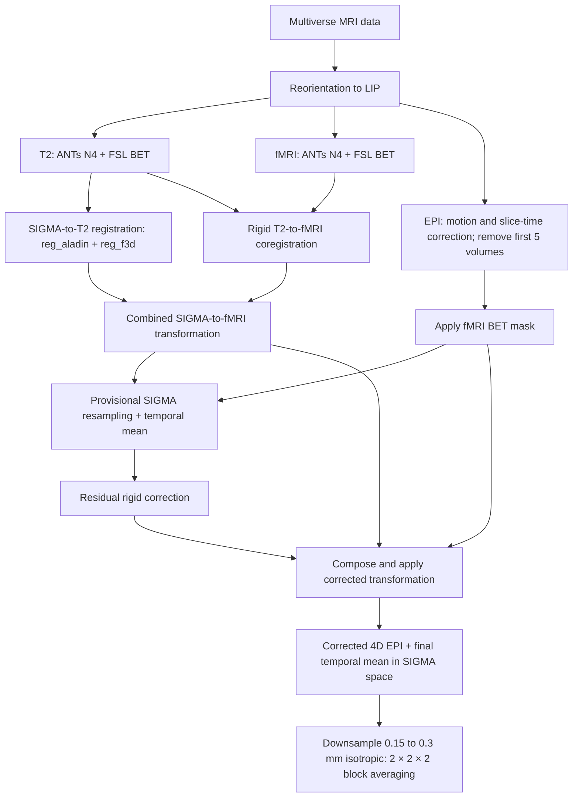

# AIDAmri processing of the Multiverse dataset

The Atlas-based Imaging Data Analysis Pipeline for structural and functional
MRI of the rodent brain (AIDAmri) is an automated tool for standardized data
handling and preprocessing [1]. For the Multiverse rat dataset, AIDAmri uses
the SIGMA in-vivo rat brain template and anatomical atlas.

## Details of the processing steps

### 1. Data inspection and reorientation

Images and NIfTI headers were reoriented to LIP (Left-Inferior-Posterior) orientation.

### 2. T2 preprocessing and registration

T2-weighted images were corrected for intensity inhomogeneity with ANTs
N4BiasFieldCorrection. Brain extraction was performed with modified FSL
BET for rodents.

The SIGMA MRI template was first registered to the brain-extracted T2 image
with NiftyReg `reg_aladin`. The alignment was then refined using the non-linear
B-spline registration of `reg_f3d`. The resulting transformation was applied to
the SIGMA anatomical atlas, using nearest-neighbour interpolation for atlas
labels.

### 3. fMRI processing

#### 3.1 Preprocessing and registration

As for T2, bias-field correction was performed with ANTs
N4BiasFieldCorrection and brain extraction with FSL BET.

The fMRI reference and anatomical T2 image were rigidly coregistered using one
of two approaches. For most samples, FSL FLIRT was used with six degrees of
freedom and the correlation-ratio cost function. For selected samples,
NiftyReg `reg_aladin` was used instead. The FLIRT transformation was inverted
to obtain the required T2-to-fMRI direction and converted to NiftyReg format;
`reg_aladin` generated this transformation directly. The resulting affine was
combined with the non-linear SIGMA-to-T2 transformation. This produced the
`*Matrixcomp_rsfMRI.nii.gz` transformation used to map the SIGMA atlas directly
into fMRI space.

#### 3.2 Motion correction, regression and filtering

The four-dimensional EPI underwent slice-wise motion correction with FSL
MCFLIRT. Differences in acquisition time between slices were corrected with
FSL SliceTimer using the slice-timing information from the BIDS metadata. The
first five volumes of each EPI time series were then removed before all
subsequent processing steps. Consequently, the final preprocessed 4D EPI in
SIGMA space contains five fewer time points than the original acquisition.

Finally, temporal band-pass filtering between 0.01 and 0.2 Hz was applied to
reduce slow signal drifts and high-frequency fluctuations while retaining the
frequency range of interest for resting-state functional connectivity.

### 4. Multiverse-specific output

To transform the EPI data into SIGMA space, the complete
`*Matrixcomp_rsfMRI.nii.gz` transformation was inverted with NiftyReg
`reg_transform -invNrr`. Before resampling, the motion-corrected 4D EPI was
masked in native fMRI space with the BET mask of the registration reference.
The masked 4D EPI was provisionally resampled into the SIGMA template grid and
temporally averaged. A residual rigid alignment between this 3D mean and the
SIGMA template was estimated with `reg_aladin -rigOnly`. This affine correction
was composed with the original inverse transformation. The resulting corrected
transformation was then applied directly to the native masked 4D EPI with cubic
interpolation, avoiding two resampling operations in the final data path. A
final temporal-mean image was calculated from the corrected registered data.

The corrected 4D EPI and its temporal-mean image in SIGMA space were then
downsampled from 0.15 mm isotropic to 0.3 mm isotropic voxel resolution by
averaging non-overlapping 2 × 2 × 2 voxel blocks.

The exported EPI is motion and slice-time corrected and has
the first five volumes removed. It is exported before physiological
regression, SUSAN smoothing and temporal filtering to preserve the original EPI
contrast.

The main outputs are:

1. motion-corrected 4D EPI in SIGMA space at 0.3 mm isotropic resolution;
2. slice-wise MCFLIRT motion parameters;
3. temporal-mean EPI in SIGMA space at 0.3 mm isotropic resolution; and
4. regional time series and functional-connectivity matrices.

## Graphical summary

## Tools used by AIDAmri

| Tool | Version | Description |
|---|---:|---|
| FSL | 5.0.11 | BET, FLIRT, MCFLIRT, and temporal filtering |
| NiftyReg | 1.5.55 | Registration and transformation handling |
| ANTs | 2.6.2 | N4 bias-field correction |
| Python | 3.10 | Pipeline execution |
| Docker/Ubuntu | Ubuntu 22.04 image | Reproducible environment |

The exact AIDAmri revision is recorded in `AIDAmri_git_information.txt`.

## Contributors and conflicts of interest

Julian Cramer, Aref Kalantari, Daniel Mertens and Markus Aswendt. University of Frankfurt and
University Hospital Frankfurt am Main, Department of Neurology,
Frankfurt am Main, Germany.

No conflict of interest was declared.

## Reference

[1] Pallast N, Diedenhofen M, Blaschke S, Wieters F, Wiedermann D, Hoehn M,
Fink GR, Aswendt M. Processing pipeline for Atlas-based Imaging Data Analysis
(AIDA) of structural and functional mouse brain MRI. *Frontiers in
Neuroinformatics*. 2019;13:42. https://doi.org/10.3389/fninf.2019.00042
